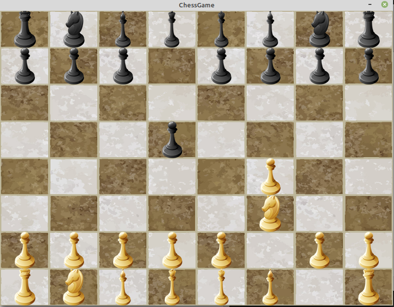
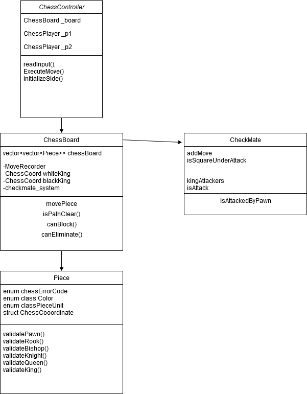
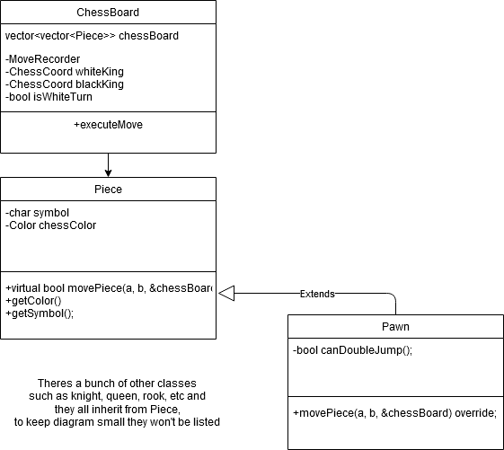

About 
---
A text-based Linux game.
To see the rules on how to play the game click
<a href="https://en.wikipedia.org/wiki/Chess"> here</a>.
Can only be played locally and requires 2 players to have a game.
There is a graphical based version in the other branch. A newer better designed version is in the other branch.

Screenshots
---

Requirements
--- 

* CMake
* C++17
* Boost >= 1.68

Why this design isn't good.
---

With the current design I'm using, Chessboard has way too many responsibilities. It checks for unit collision, handles castling, and needs to know what type of piece it is moving and the pieces color to execute certain moves. It has logic to check whether the king can execute certain moves as well it checks for stalemates as well, whether if pieces can block checks from enemy pieces. It even has logic for moving knights as well.
The ChessBoard should only hold the position of pieces and sends commands to Pieces and the pieces themselves should decide whether the move is valid. A better design I came up with…

Instead we will have the board hold Pieces and each chess unit inherits from that piece and define its own move. Also, if a piece has any special properties, we can have it be part of a piece and we don’t need to track it inside the board class. To check for unit collision, the Piece class with have a unit collision class that takes in a board and 2 coordinates and checks for unit collisions. This way all the unnecessary logic that was in the old design can be moved into chessPieces. The code for it is in ChessV2, however that version is a work in progress for now.

